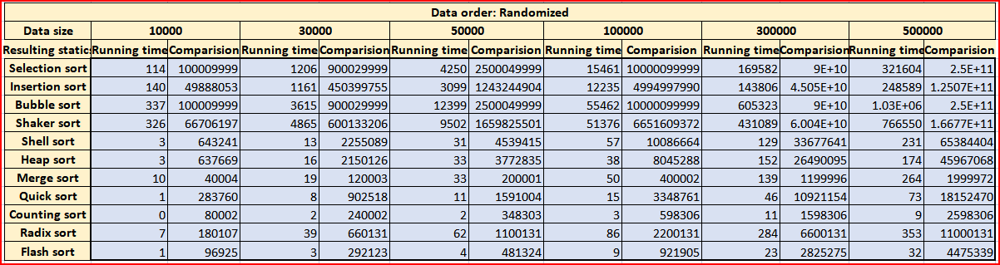
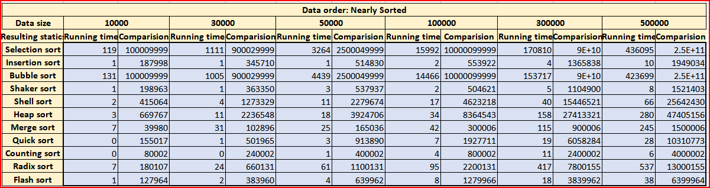
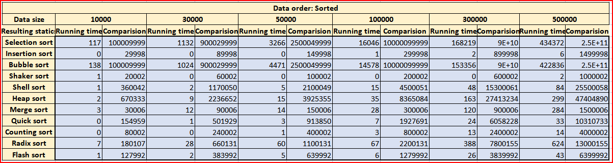
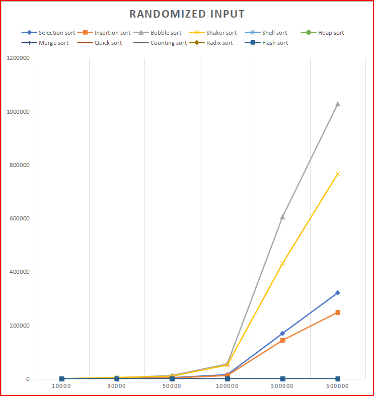
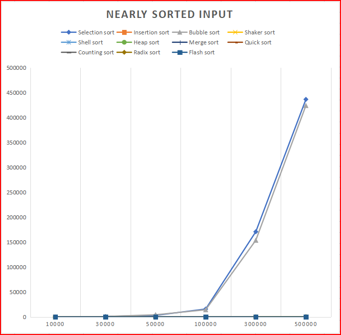
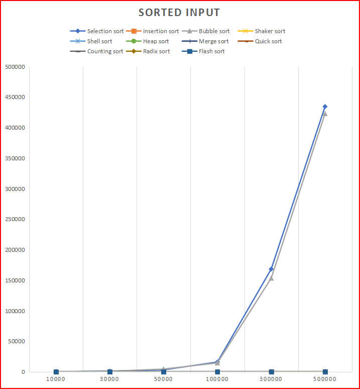
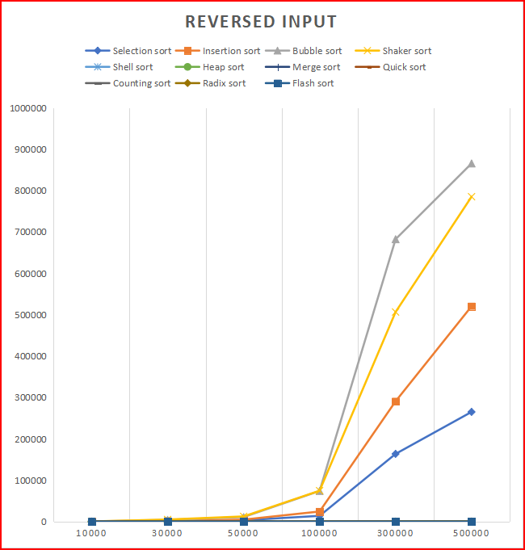
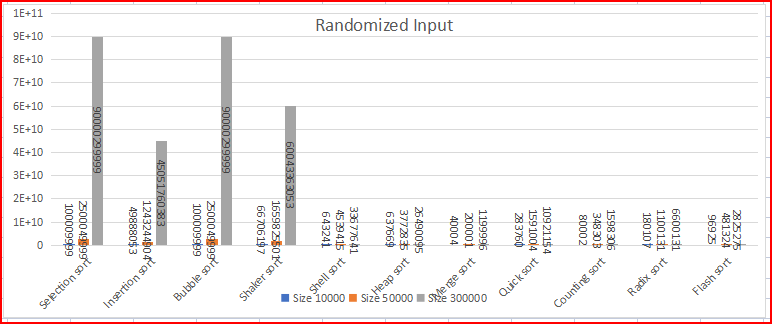
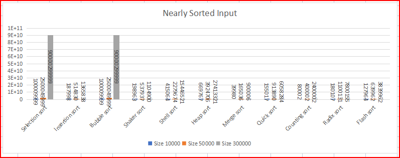
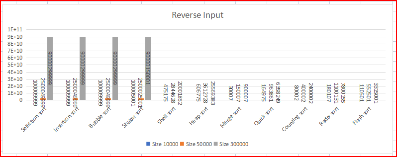

<!-- <head> -->
<!-- <title>21120499_21120504_21120505_21120521</title> -->


<!-- Bìa báo cáo -->

---

<h2 align = "center" style = "color: #6366F1"> 
    <p> ĐẠI HỌC QUỐC GIA THÀNH PHỐ HỒ CHÍ MINH </p>
    <p> TRƯỜNG ĐẠI HỌC KHOA HỌC TỰ NHIÊN </p>
    <p> KHOA CÔNG NGHỆ THÔNG TIN </p>
    </br>
    </br>
    
    </br>
    </br>
    <p> BÁO CÁO THỰC HÀNH </p>
    <p> MÔN HỌC: CẤU TRÚC DỮ LIỆU VÀ GIẢI THUẬT</p>
    <p> CHỦ ĐỀ: TÌM HIỂU VÀ THỰC HÀNH CÁC THUẬT TOÁN SẮP XẾP </p>
    

</h2>
</br>
</br>
</br>

<!-- 
💕🤘

🤙

👈

👉
🔆 
-->


<!-- Thông tin nhóm -->
<h3 align="center" style = "color: #6366F1; font-size: 26px;" >👉 NHÓM 02 👈</h3>

<h4 style = "color:#6366F1 ; font-weight: normal" > 
    <p style = "padding-left: 27%; font-size: 22px" >21120499 - Nguyễn Duy Long </p>
    <p style = "padding-left: 27%; font-size: 22px" >21120504 - Nguyễn Phương Nam </p>
    <p style = "padding-left: 27%; font-size: 22px">21120505 - Bùi Thị Thanh Ngân </p>
    <p style = "padding-left: 27%; font-size: 22px" >21120521 - Nguyễn Phúc Phát  </p>
    <p style = "padding-left: 15%; font-size: 24px" >💕 Giảng viên hướng dẫn: Thầy Lê Đình Ngọc 💕 </p>
</h4>
</br>

<!-- --- -->

<div class = "page" > </div>

---

<h3 align = "center" style = "color: #3B82F6; font-size: 30px" >MỤC LỤC</h3>
</br>

<h2 id="i-trang-th%C3%B4ng-tin"><a href="#none">I. Trang thông tin</a>.....................................................................................</h2>
<h2 id="ii-gi%E1%BB%9Bi-thi%E1%BB%87u"><a href="#gi%E1%BB%9Bi-thi%E1%BB%87u">II. Giới thiệu</a>.............................................................................................</h2>
<h2 id="iii-tr%C3%ACnh-b%C3%A0y-thu%E1%BA%ADt-to%C3%A1n"><a href="#tr%C3%ACnh-b%C3%A0y-thu%E1%BA%ADt-to%C3%A1n">III. Trình bày thuật toán</a>.............................................</h2>
<h2 id="iv-k%E1%BA%BFt-qu%E1%BA%A3-th%E1%BB%B1c-nghi%E1%BB%87m"><a href="#k%E1%BA%BFt-qu%E1%BA%A3-th%E1%BB%B1c-nghi%E1%BB%87m">IV. Kết quả thực nghiệm</a>..........................................................................</h2>
<h3 id="1-b%E1%BA%A3ng-s%E1%BB%91-li%E1%BB%87u-th%E1%BB%91ng-k%C3%AA" style = "padding-left: 50px"><a href="#b%E1%BA%A3ng-s%E1%BB%91-li%E1%BB%87u-th%E1%BB%91ng-k%C3%AA">1. Bảng số liệu thống kê</a>..............................................................................</h3>
<h3 id="2-%C4%91%E1%BB%93-th%E1%BB%8B-minh-h%E1%BB%8Da" style = "padding-left: 50px"><a href="#%C4%91%E1%BB%93-th%E1%BB%8B-minh-h%E1%BB%8Da">2. Đồ thị minh họa</a>..............................................................................</h3>
<h3 id="3-nh%E1%BA%ADn-x%C3%A9t-chung"><a href="#nh%E1%BA%ADn-x%C3%A9t-chung" style = "padding-left: 50px">3. Nhận xét chung</a>..............................................................................</h3>
<h2 id="v-t%E1%BB%95-ch%E1%BB%A9c-%C4%91%E1%BB%93-%C3%A1n-v%C3%A0-c%C3%A1c-l%C6%B0u-%C3%BD"><a href="#t%E1%BB%95-ch%E1%BB%A9c-%C4%91%E1%BB%93-%C3%A1n-v%C3%A0-c%C3%A1c-l%C6%B0u-%C3%BD">V. Tổ chức đồ án và các lưu ý</a>................................................................</h2>
<h2 id="vi-t%C3%A0i-li%E1%BB%87u-tham-kh%E1%BA%A3o"><a href="#t%C3%A0i-li%E1%BB%87u-tham-kh%E1%BA%A3o">VI. Tài liệu tham khảo</a>..............................................................................</h2>

<div style = "height: 500px"></div>


<!-- --- -->
<div class = "page" ></div>


___

<!-- Giới thiệu -->
<h2 id = "gi%E1%BB%9Bi-thi%E1%BB%87u" style = "color: #3B82F6; text-align:center">Giới thiệu</h2>


<div style = "height: 900px"></div>

<!-- ___ -->

<div class = "page" ></div>


<!-- Trình bày thuật toán -->
***

<!-- Trình bày thuật toán -->
<h2 id="tr%C3%ACnh-b%C3%A0y-thu%E1%BA%ADt-to%C3%A1n" style = "color: #3B82F6; text-align:center; ">Trình bày thuật toán</h2>
<!-- Các thuật toán sắp xếp -->

<div style = "height: 100px" ></div>

<table style="width:100%" class = "table-algorithms">
  <tr>
    <td>
        <h3 id="31-selection-sort"><a href="#one-selection-sort">1. Selection Sort</a></h3>
    </td>
    <td>
        <h3 id="32-insertion-sort"><a href="#two-insertion-sort">2. Insertion Sort</a></h3>
    </td>
    <td>
        <h3 id="33-bubble-sort"><a href="#three-bubble-sort">3. Bubble Sort</a></h3>
    </td>
  </tr>
    <tr>
        <td>
            <h3 id="34-shaker-sort"><a href="#four-shaker-sort">4. Shaker Sort</a></h3>
        </td>
        <td>
            <h3 id="35-shell-sort"><a href="#five-shell-sort">5. Shell Sort</a></h3>
        </td>
        <td>
            <h3 id="36-quick-sort"><a href="#six-quick-sort">6. Quick Sort</a></h3>
        </td>
    </tr>
    <tr>
        <td>
            <h3 id="37-heap-sort"><a href="#seven-heap-sort">7. Heap Sort</a></h3>
        </td>
        <td>
            <h3 id="38-merge-sort"><a href="#eight-merge-sort">8. Merge Sort</a></h3>
        </td>
        <td>
            <h3 id="39-counting-sort"><a href="#nine-counting-sort">9. Counting Sort</a></h3>
        </td>
    </tr>
    <tr>
        <td>
            <h3 id="310-radix-sort"><a href="#ten-radix-sort">10. Radix Sort</a></h3>
        </td>
        <td>
            <h3 id="311-flash-sort"><a href="#eleven-flash-sort">11. Flash Sort</a></h3>
        </td>
        
</table>


<div class = "type-alg">
        <h3 id="31-selection-sort"><a href="#one-selection-sort">1. Selection Sort</a></h3>
        <h3 id="32-insertion-sort"><a href="#two-insertion-sort">2. Insertion Sort</a></h3>
        <h3 id="33-bubble-sort"><a href="#three-bubble-sort">3. Bubble Sort</a></h3>
            <h3 id="34-shaker-sort"><a href="#four-shaker-sort">4. Shaker Sort</a></h3>
            <h3 id="35-shell-sort"><a href="#five-shell-sort">5. Shell Sort</a></h3>
            <h3 id="36-quick-sort"><a href="#six-quick-sort">6. Quick Sort</a></h3>
            <h3 id="37-heap-sort"><a href="#seven-heap-sort">7. Heap Sort</a></h3>
            <h3 id="38-merge-sort"><a href="#eight-merge-sort">8. Merge Sort</a></h3>
            <h3 id="39-counting-sort"><a href="#nine-counting-sort">9. Counting Sort</a></h3>
            <h3 id="310-radix-sort"><a href="#ten-radix-sort">10. Radix Sort</a></h3>
            <h3 id="311-flash-sort"><a href="#eleven-flash-sort">11. Flash Sort</a></h3>

</div>

<style>
    body {
        
        border: 1px  double #059669;
        /* border-style: double; */
        
    }

    .page {
        border: 1px  double #059669;
    }

     hr {
        border-top: 1px double #059669;
        border-bottom: 1px double #059669;
    }

    .type-alg{
        display: flex;
        flex-direction: row;
        flex-wrap: wrap;
        justify-content: space-around;

    }

    .type-alg h3{
        flex-basis: 33%;
        text-align: center;
        border: 1px solid #2563EB;
        border-radius: 5px;
        border-style:  double;
        padding: 20px ;
        background-color: #E0E7FF;
        
    }

    .type-alg h3 a{
        color: #8B5CF6;
        text-decoration: none;
    }

    .type-alg h3 a:hover{
        color: #EF4444;
    }

    .type-alg h3:hover{
        background-color: #FECACA;
        color: #333;
    }

</style>

<style > 
    .table-algorithms {
        display: none;
        border-collapse: collapse;
        width: 100%;
        flex-direction: row;
        align-items: center;
        flex-wrap: wrap;
        justify-content: space-around;
    }
    
    .table-algorithms td, .table-algorithms th {
        border: 1px solid #ddd;
        padding: 8px;
    }
    
    .table-algorithms tr:nth-child(even){background-color: #f2f2f2;}
    
    .table-algorithms tr:hover {background-color: #ddd;}
    
    .table-algorithms th {
        padding-top: 12px;
        padding-bottom: 12px;
        text-align: left;
        background-color: #4CAF50;
        color: white;
    }

</style>

<div style = "height: 270px"></div>
<hr>

<!-- *** -->
<div class = "page"></div>

<!-- Trình bày -->
---

<!-- #### :one: Selection Sort -->

<h4 style = "text-align: center; font-size: 28px; color: #3B82F6" id="one-selection-sort"> Selection Sort</h4>


1. Ý tưởng thuật toán:
```
    Mỗi bước sẽ di chuyển một phần tử nhỏ nhất sang bên trái, từ đó mảng sẽ dần được chia làm 2 phần: 

    Bên trái là mảng đã được sắp xếp tăng dần. 

    Bên phải là mảng chưa được sắp xếp. 
```

2. Psuedocode:
```cpp
    For i = 0 to n – 2 

        min_index = chỉ số phẩn tử nhỏ nhất trong khoảng i + 1 đến n – 1 

        swap (a(i), a(min_index))
```

3. Độ phức tạp: 
```

    Không gian: O(1) 

    Thời gian: O(n^2)
```

4. Biến thể và cải tiến:
``` 

    Heap sort sử dụng cùng ý tưởng tìm các giá trị lớn nhất nhỏ nhất, nhỏ nhất nhưng dùng đến cấu trúc heap nên độ phức tạp giảm còn O(nlogn). 

    Double selection sort, tìm cùng lúc giá trị lớn nhất và nhỏ nhất sau đó di chuyển các giá trị này đến đầu và cuối mảng.
``` 

<!-- --- -->
<div class = "page" ></div>

---
<!-- #### :two: Insertion Sort -->
<h4 style = "text-align: center; font-size: 28px; color: #EF4444" id="two-insertion-sort"><img class="emoji" alt="two" src="data:image/png;base64,iVBORw0KGgoAAAANSUhEUgAAAEAAAABACAYAAACqaXHeAAANhUlEQVR4Xu1bWYxc1Zn+zl1qr67qxd3uFdttx0Bjg2k6Y0dCgw04QEAEDVKIUKSEMHJIRPKSKA/ZlEjZFI1QFGlGLEOIogjxgBhgUEgUE2XAToIxtttubGw3tHtdXL1UdW237r3n5NR/r7rsVu1tY/eQr/S76uWUz/ed//xb12VCCHycoeDjjX8KoKFKMInte760Q1OVO1RV36HqehdTmIcx9YqpyAEIYUNwkbNNc9y2zSOWzf80+MavjwiJSyZA/+1ffmDXvV/7lj8UHfCHQpru9UBRNTBFBRgAwXBFwAQgAMFtcNuCaeQeyiSTltzrIbnnXxze/98voQLKBsFtd/x7W0BXn4ysW39/uLEZvnAQkj0gyeu6Dq9XhSY/K+zKCMCFgCWJG4YN0zQB+dkyDWSXUlhamEP8/PTLadPed/xPT8/U7AE37fliX6Sh6YWm9s6+SHMzPKEgVI8XXeuiuL5nHXraImgK+xHwatBUBR+1BkJAkudIGxbmlzIYnYnjvdHzGD+/CF8ojEA4DF8wfP/81MRmyeVzR994bqhqAbb96yPdkeamV9Z1btzU2NYMzRdAa3MUe/t70b+lDR5dQzZnIZk1YVg2spaFjzibkuCKwhD0e9DWGMSOzetx9yd7cfjMDP54eBizmg7d54GqefowgVckp9uO/+XZsYoCMImdn3n8qZb2nk2N7a1Efus1bfjC7X0I+704OxXH5HwKScOCzQWENOf10YKRyZfCoEoLeTV0NAUxsLUd1/Y04bf7h/D+uRk0tqsQ3N5k56ynJLV7hERZAW65c99D0XXtd0VaW+DxBdHb3YpH9m7HQsrAwZOzSBkmFMZIfUaCORu5YuAClrT5nIFYIovhqQS2b2yiPT/z+iCGx2aR52KkM3fluQF4vmQQvOWWfbq/u+Gv7Zu39De2tSISieKx+3Ygbdg4+kHMUZsxCFydYABs4XjlTZtaEPCq+K9XjyAeX8TCzCymzp45nBlL7HrnnSfNoh5gN4uBQKSpP9AQBtM9+FRfFyxb4N3h81Ap0DFwXL0QAO0RCmjPO7e2EYfXD6WR55TnlkzHBwAcLCqApnp3ByJh6D4fouEANrVHcXwkRm4OIbCG+gba86Dc+5aOKHGZyxnIc1NnPHtKCqDrvpt0r5cKnPWNYSTSOSQyJqU5vgabpqWMibjk0C65zC8kkOfm8fhvLBkENU3v1HQdqqIi5NMRi2dIyUtBnrn/UAB17yrnheyhMIrmzv/HQYKL1XsBcQj6HU6SG3EsKQBjqk9RFSiqCqYoSGUtQOBSuD5lDcviGFvMYDKeRcbksJwgTtCYY1G/jq5GP5pCHjAwEmk1SEsOjBEnaQpxLCWAm1xVejctGx5Nxeq4CwpKCgPOzaVwZjZFuXrPti70rg+jNeKn65VHNmdjfC6JwdEFDJ6bhzWZQF9HAxqDXtirEIELTlwu5FZGAMHcHgs5ucjPyU1X44K0/uj4IhRdw+N3X49+mZ5Kobs5gF2faEU6Z2H/iSn8z99H0BX1YlNLEDav9+ox4kKuDE4cSwtAnRWjd8u2YXNOd7UeMNdOjMexoT2KfXdeB5+uohoEPBruu7kb/Rub8cRrJzA8u4QN60L1eQJnxOVCbmUEEMvGbWn1pz5y/XPnU9jQFsE37rkB9aCjMYDvPHATfv7SEcwlDDSGPDUHZA4Qlwu4lRaAU01vE2meN87BRX2nv2SYEIzhS7dvxWoQDXrwyJ5r8cwfTiDkU0nYmsCWD5K4cZQRQBTeHSm4qE8ABpxPZnH3LRvR4PegGCbnkjg1NodMzoauKuhpDWNrV1NRgls6Irh+QxPG5VVoDHpqCsyCEZcCt/LdoA0ITomYSxNCWh0K5GyOsE9Hf28riuG90Rj2HzlHwUlhjAidGJnF8NQC9t68CbqmYCUG5Hd9OLkAzlWgFgEURlwgjbjBLiMAkaYPsEkEcp9aT5/mBNf1tNCwZCUWkln8+egoLJtO/sKEKUWIoSUSxL/IlnYlulrCCPl1mBangqlqcBAXgLgRx/JZQDgOY5l2vTGACp5N6yMohmPDs1hK5+DzqCtTLHWaJ8/F0L+5za0PCvB7NIS9Hrk2C1bLGJY5XIgVBUFUiAHuiacNE2GLAwy1uRw1VQyt0QBWgGLKyMwiGATsIok9L348laVpU2hl7GAA3HWshmhsC4cLQYhKMaCQ9uQmaKHfq9dSDNF6GlX59CJlqYnFpAEBFMvp5HFLFi8T6QXVJYyLqsvvjGESFwmXmyh3BWxSiVGwyJ9GBqrKoCms2shLxGQjRcHNppiyHBtoMxbNDznd+QIt0L2eT2YQbQgiUES8rGFKAXNglNJ4VbEoZzkcAJcTXQG7vAdQIOScVDZNjrl4Gg0BDw1CCyqWgXCIPv/GCSisoDeDI4hp50VxTpLgkk9lTQxOxPHj3duKuvjMQgrJdI4OpExFuOw9uZxF7bxlERfiBGnlPQBuzmSQJqBIMy2bxs4+jwa/pzACd3WAKDaWsoHp+SUUA02W3HUMIO9KZHLYPzSFL9+5XQbA4qnz6PA0TMsCY+pFFNgy8cKoPJOzyO2FAB0CZy4niEpjcaoCLzIGtnyqWcOiHO3VVRKC+neXtoC4SJASmYpOQhT6f5yZjuOd4Rgev3cHHv30NhTDyPQihj6chermdCLsysida0fEDdOmNCkgwOiFlXzK1wG2oBUApwX02WW4/GU504IhzSVAuVwlMRQizZgrSpnkoamMOr63Tk5BYyp++ehu3LbjGhRDMmPg5QOnyBNpMuVWp9So2XSl3IpVLB8GczMGwSVOi+jqlfMAIn6xFYMrBqlNvTaI+PK4XCl8Xh6bu3/IIBKn5am/e3oWD+zcgm8/tAuhoBfFkEgb+M3rR/Dh1MLyWI7zlU1aQfRCJkMBK/lwUSkNFtKFfFVZAzhiWSs8jMDg3nUFOSFw4MQEvBmOX331DuzeuRmlMBFL4DlJXro/XTlqaQvf54JVEZhdLsIVBhUEALi7gEtjxGBVEE7gm0pk8Nbhc7i37xr85Ot70dQSRim8NTgi3f4kFlMGkb9w0xefiajycHiBWxkBXNKiYC6DVYBixPtTizhzcgY/f/hWPPxvAyiF2YUkXnxzSF6PCYopXl3B6kejKwNh2V6g0A2SKXw1HkD39thIDImpJbz4wwdx47YelML/HfsQrx48SSnXq1PfTxtePUSBj+BFC6HiQyFHuVWRPz25gOxcBi/99PPo6WlBMSxIwi+8cQyH3h93T10tca/rF0AUeBEqDEQ4ZVdWfwygri62lMb0TAIvfPfBkuTPjsfw3O/fweRcggotsAqdl6jnQgiHC7jLreJMEGSC037qAmcCp0bn8YMv3IZP9K4v0RZP4en/fRtpIwddkrcdgmXHbIpzlDUfihsDXRMVKkHw5ZkAI8VqUoHy/8R8EjdsbMNndxcfhv71+Dl85WcvYnE64YgtqjhFXcWW7Z3Ysj5Ke6wWDMTF5VRkIlQ2YtJC1AJqchbTOXzzoX6UAP205ol9d8GrKNUTURh+9/YpLKXSNDYXVS9cWdhVngcUvICLmtIgo0GKhV55Sjuv60YpbN3QSlYr/jY2jSPvJ8u2w8WDOnGqYh7AC81QXYUQA7KmhYHNndA1FZcaNNur2SsdLoVS2C4/E8SKYqhGkNdsWN+Iy4A691VY49QBZa8AtZLLHSGF3Rpn8LqioLO5AZcDIY8O5u6tarBCJ0jcULoSXD0E4PeoODj4AYbHz5OGlwoKA8ZnF6Cr6uX8rbDjJoU7U3spzBRgcHgC1mmOSwyqElVVqSkN4sIeQFRohrgQrPI8oDJ0TSG7DKhjTytnHGWeF+DCMin1cfz/AzmAgMXNXEkPMI3sLLdM2Nyi2RuznWnjmgZNkThxIm5Gdq60ANn0e5Zp3GObFriPO6MsgTUNpwTisE0TkhtyRnaopABGMnnAyKa+aZkmuM2hMBVQ1rgAHMTFMi1IbpJj4kBJAUZGjr8b7egZCkdb+7xBP+gXY0LFWgYXNizLQC6dQjJ+fijPsaQAyGSSydjks+mm9v/wBoL0MATTGZzX2oIgE3Tvc6kM0kvzyHPLcyxXCGXOHjv4mj/S+lmPL3yromnwhVQoijTGAIG1AQZ3hG4jm84gFV/E/MzYm3luADLlnhrL5m3q9NHvLc6OjucXZlMp2JZJkVRArI2gxzntWe6dyOe55DnB5Vd6JCbBGJuPTY94veHQY0Kw/+S23W1HovD5fVB0nbyBOTJfhdRBp85NST6TRVqSX5geHRs/e/QxyWkKwLyQqPjQFGOsE0CwpWtzR2fv9u9H23p2Bxsa4QkEQL8l1tSrK0NwJ9jZlo18Bsul00glFrA4M/rnieHBH8XGz04CSEmuEyBUFkAD0A1Ah0TvjbfujbT2PBqKtNzo9YWgefOeoEljAFOueJ7jXEizYBkmjGwSyXjsWHx29JnhY2/+EQ5MAGOSq1VZgIIIXgAdJIIDZUPfJ3f4gi0DHl/wWt3jbWOqqikMEiquDGyn07Vty8wZM7ls6lQ2FTs0MvT2EfKLAvlJydOo+blB1xPaAASxNpECMFM4+fIClBMiBKAJgA9rA1k34CVre3K0shB+AHnzuhmEXUV1jwXAAJCRnDKoEv8AXxg+6ZAWnbMAAAAASUVORK5CYII=" align="center"/> Insertion Sort</h4>


1. Ý tưởng thuật toán:
```
    1. Chèn phần tử thứ hai vào vị trí thích hợp trong mảng con đã được sắp xếp.
    2. Chèn phần tử thứ ba vào vị trí thích hợp trong mảng con đã được sắp xếp.
    3. Lặp lại cho đến khi chèn phần tử cuối cùng vào vị trí thích hợp trong mảng con đã được sắp xếp.

```

2. Psuedocode:
```cpp
     for i = 1 to n - 1
        x = a[i]
        j = i - 1
        Duyệt j và tìm vị trí thích hợp cho x, đồng thời dịch các phần tử sang phải để tạo chỗ cho x
        Chèn x vào vị trí thích hợp

```

3. Độ phức tạp: 
```
    
        Không gian: O(1)
    
        Thời gian: O(n^2)

        Trung bình, thuật toán sắp xếp chèn – Insertion sort có độ  phức tạp là O(n^2)
        Trường hợp tốt nhất là với đầu vào đã được sắp xếp đúng thứ tự. Trường hợp xấu là dãy bị đảo ngược thứ tự hoàn toàn.

```

4. Biến thể và cải tiến:
``` 
    Shell sort sử dụng cùng ý tưởng tìm các giá trị lớn nhất nhỏ nhất.
    Áp dụng trong flash sort.
    Có thể dùng binary search để giảm số lần so sánh.
```

<!-- --- -->
<div class = "page" ></div>

---

#### :three: Bubble Sort
1. Ý tưởng thuật toán:
```
    1. So sánh 2 phần tử liền kề, nếu phần tử đứng trước lớn hơn phần tử đứng sau thì hoán đổi chỗ 2 phần tử này.
    2. Lặp lại cho đến khi không còn phần tử nào cần hoán đổi chỗ.

```

2. Psuedocode:
```cpp
        for i = 0 to n - 2
            for j = n - 1 downTo i + 1
                if a[j] < a[j - 1]
                    swap (a[j], a[j - 1])

```

3. Độ phức tạp: 
```
    Không gian: O(1) 

    Thời gian: O(n^2) đối với trường hợp tệ nhất, O(n) đối với trường hợp tốt nhất.

```

4. Biến thể và cải tiến:
``` 
    Trong mỗi vòng lặp của biến j ở trên, kiểm tra xem nếu không có phép hoán vị nào được thực hiện tức mảng đã đúng vị trí ta sẽ dừng thuật toán ngay lập tức. Trong trường hợp tốt nhất mảng đã được sắp xếp độ phức tạp về thời gian là O(n)

    Biến thể là Recursive Bubble Sort và Shaker Sort.
```

<!-- --- -->
<div class = "page" ></div>

---
#### :four: Shaker Sort
1. Ý tưởng thuật toán:
```
    1. So sánh 2 phần tử liền kề, nếu phần tử đứng trước lớn hơn phần tử đứng sau thì hoán đổi chỗ 2 phần tử này.
    2. Lặp lại cho đến khi không còn phần tử nào cần hoán đổi chỗ.
    3. Lặp lại bước 1 và 2 nhưng lần này so sánh từ phải sang trái.

```

2. Psuedocode:
```Cpp
    left = 0 
    right= n - 1	 
    k = 0 // vị trí hoán vị cuối cùng:
    while left < right // l->r là khoảng cần sắp xếp
	    for i = left to right 
		    if a[i] >a[i+1] 
			    swap 2 phần tử để đẩy phần tử lớn nhất trong khoảng xét về cuối
			    cập nhật vị trí k = i
	    right = k // thu hẹp khoảng xét bên phải
	    for i = right to left 
		    if a[i] <a[i-1]
			    swap 2 phần tử để đẩy phần tử nhỏ nhất trong khoảng xét về đầu
			    cập nhật vị trí k = i
		left = k // thu hẹp khoảng xét bên trái
```

3. Độ phức tạp: 
```
    Không gian: O(1)

    Thời gian: O(n^2)
    Có độ phức tạp tương tự như Bubble Sort nhưng có thể tối ưu hơn về thời gian trong trường hợp tốt nhất.

```

<!-- --- -->
<div class = "page" ></div>

---

#### :five: Shell Sort
1. Ý tưởng thuật toán:
```
    Shell sort là một biến thể cải tiến hơn của insertion sort.  
    Thuật toán sử dụng insertion sort lên các phần tử cách xa nhau sau đó thu hẹp dần khoảng cách này. 
    Như vậy mảng sẽ được chia thành các mảng con với các phần tử có khoảng cách là h
    sắp xếp các mảng con này bằng insertion sort và lặp lại các bước trên với khoảng cách thu hẹp dần thì ta được mảng có thứ tự. 

```

2. Psuedocode:
```cpp
    h = n / 2 

    While h >  0: 

        For i = h đến n – 1: 

        (Selection sort cho mảng từ 0 – i với bước chạy là h)

            temp = a(i) 

            Đẩy tất cả các phần tử lớn hơn temp lên h đơn vị 

            Chèn temp vào trị ví thích hợp 

        h / 2  

```

3. Độ phức tạp: 
```
    Không gian: sắp xếp tại chỗ nên là O(1) 

    Thời gian: độ phức tạp của shell sort tùy thuộc vào h ta chọn, với những h thích hợp
    ta có thể tối ưu shell sort hơn nữa. Với h = h/2 ta chọn ở trên: 

    Trường hợp tệ nhất là khi shell sort trở thành insertion sort, lúc này độ phức tạp thời gian là O(n2) 

    Trường hợp tốt nhất là khi mảng đã được sắp xếp sẵn thì độ phức tạp sẽ là O(nlogn) 

    Trung bình thời gian chạy của shell sort sẽ là O(nlogn) 

```

4. Biến thể và cải tiến:
``` 
    Dobosiewicz sort 

    Shaker sort 

    Insertion sort 

```

<!-- --- -->
<div class = "page" ></div>

---

#### :six: Quick Sort
1. Ý tưởng thuật toán:
```
    1. Chọn một phần tử làm pivot.
    2. Đưa các phần tử nhỏ hơn pivot về bên trái pivot, các phần tử lớn hơn pivot về bên phải pivot.
    3. Lặp lại bước 1 và 2 cho đến khi không còn phần tử nào cần sắp xếp.

```

2. Psuedocode:
```cpp
  quickSort(a, l, r)
    if l < r
        p = partition(a, l, r)
        quickSort(a, l, p - 1)
        quickSort(a, p + 1, r)

    partition(a, l, r)
    pivot = a[r]
    i = l - 1
    for j = l to r - 1
        if a[j] <= pivot
            i = i + 1
            swap a[i] and a[j]
    swap a[i + 1] and a[r]
    return i + 1

```

3. Độ phức tạp: 
```
    Không gian: O(logn)

    Thời gian: O(nlogn)

```

4. Biến thể và cải tiến:
``` 
    Quick sort 3-way: sử dụng 3 pivot để chia mảng thành 3 phần.

    Quick sort random: chọn pivot ngẫu nhiên.

    Quick sort median: chọn pivot là phần tử ở giữa mảng.

```

<!-- --- -->
<div class = "page" ></div>

---

#### :seven: Heap Sort

1. Ý tưởng thuật toán:
```
    1. Tạo max - heap từ mảng.
    2. Lấy phần tử lớn nhất tại vị trí 0 và đưa về cuối mảng, giảm kích thước của mảng đi 1.
    3. heapify lại mảng.
    4. Lặp lại bước 2 và 3 cho đến khi kích thước của mảng bằng 1.

```

2. Psuedocode:
```cpp
    buildMaxHeap(a, n)
    for i = n - 1 to 1
        swap a[0] and a[i]
        heapify(a, i, 0)

    heapify(a, n, i)
    largest = i
    l = 2 * i + 1
    r = 2 * i + 2
    if l < n and a[l] > a[largest]
        largest = l
    if r < n and a[r] > a[largest]
        largest = r
    if largest != i
        swap a[i] and a[largest]
        heapify(a, n, largest)
```

3. Độ phức tạp: 
```
    Không gian: O(1)

    Thời gian: O(nlogn)

```

<!-- --- -->
<div class = "page" ></div>

---

#### :eight: Merge Sort

1. Ý tưởng thuật toán:
```
    Sử dụng thuật toán chia để trị xử lý 2 nữa mảng rồi trộn chúng lại với nhau. Cụ thể: 

    Mảng được chia đôi thành 2 phần bằng đệ qui cho đến khi mảng chỉ còn 1 phần tử.
     
    Trộn 2 mảng đã có thứ tự này lại bằng cách lấy lần lượt số nhỏ nhất ở đầu 2 mảng bỏ vào mảng chính. 

```

2. Psuedocode:
```cpp
    Hàm trộn 2 mảng có thứ tự left và right vào mảng chính: 

    While 2 cả mảng left và right còn phần tử: 

        Lấy lần lượt phần ở đầu 2 mảng 

        So sánh 2 phần tử này 

        Phần tử nào nhỏ hơn thì lấy bỏ vào mảng chính 

    Nếu mảng left còn phần tử: 

        Bỏ phần còn lại đó vào phía sau mảng chính 

    Nếu mảng right còn phần tử: 

        Bỏ phần còn lại đó vào phía sau mảng chính 

    Hàm mergeSort: 

    Nếu mảng có n <= 1 thì dừng 

        Chia mảng a thành 2 phần bằng nhau là 
            Mảng left 
            Mảng right 
            Thực hiện gọi đệ qui sắp xếp 2 mảng này 
            Gọi hàm trộn 2 mảng này về mảng chính 

```

3. Độ phức tạp: 
```
    Không gian:O(n) sử dụng để lưu trữ 2 mảng con. 

    Thời gian:. Thời gian chạy của merge sort khá ổn định, trong tất cả các trường hợp đều là O(nlogn). 

```

4. Biến thể và cải tiến:
``` 
    Các biến thể của merge sort chủ yếu tập trung vào việc giảm độ phức tạp về không gian và giảm số lần copy phần tử 

    Block sort: là một in-place sorting với độ phức tạp ổ định là O(nlogn) 

    Katajainen et al: cũng là một in-place sorting với độ phức tạp O(nlogn) chưa được ổn định
```

<!-- --- -->
<div class = "page" ></div>

---
#### :nine: Radix Sort

1. Ý tưởng thuật toán:
```
    Khác với các thuật toán trước, Radix sort là một thuật toán tiếp cận theo một hướng hoàn toàn khác. 
    Nếu như trong các thuật toán khác, cơ sở để sắp xếp luôn là việc so sánh giá trị của 2 phần tử 
    thì Radix sort lại dựa trên nguyên tắc phân loại thư của bưu điện. Vì lý do đó nó còn có tên là Postman’s sort. 
    Nó không hề quan tâm đến việc so sánh giá trị của phần tử và bản thân việc phân loại và trình tự phân loại sẽ tạo ra thứ tự cho các phần tử. 

    Coi các phần tử trong mảng sắp xếp được cấu thành từng các lớp có độ ưu tiên khác nhau. 
    Ví dụ, các số tự nhiên chia thành các lớp như: hàng đơn vị, hàng chục, hàng trăm, hàng nghìn, 

    Bước đầu tiên ta sắp xếp dãy các phần tử bằng cách so sánh các phần tử ở lớp có độ ưu tiên thấp nhất (ví dụ các chữ số hàng đơn vị). 
    Số nào có hàng đơn vị thấp hơn thì ta đưa lên trên. Như vậy các số có hàng đơn vị là 0 ở trên cùng, sau đó đến các số có hàng đơn vị là 1,… 
    Sau bước 1, ta thu được 1 thứ tự sắp xếp mới. 
    Ta lại làm tương tự với các lớp kế tiếp (chữ số thuộc hàng chục, hàng trăm,…)cuối cùng ta sẽ có dãy đã sắp xếp.

```

2. Psuedocode:
```cpp
    max = số chữ số của phần tử lớn nhất 

    table = mảng các queue gồm 10 phần tử( các lớp từ 0->9) 

    for k = 0 to max-1 do: 

        for i = 0 to i-1 do: 

            unit = chữ số của hàng thứ k 

            thêm a[i] vào queue table[unit] 

        end for 

        i = 0 

        j = 0 

        Gán các phần tử trong queue vào mảng theo thứ tự các lớp từ 0 ->9 

        while j < 10 do: 

            while table[j] có phần tử do: 

                a[i] = lấy ra phần tử đầu trong queue 

                i = i +1 

            j = j + 1 

        end for 

```

3. Độ phức tạp: 
```
    Không gian: O(n) vì sử dụng hàng đợi để lưu các phần tử. 

    Thời gian: O(max*n) = O(n) như nhau trên mọi trường hợp, không có trường hợp xấu nhất lẫn tốt nhất 

```

---

#### :keycap_ten: Counting Sort

1. Ý tưởng thuật toán:
```
    1. Tìm phần tử lớn nhất trong mảng
    2. Tạo mảng mới có kích thước bằng phần tử lớn nhất + 1, khởi tạo các phần tử bằng 0
    3. Lưu số lần xuất hiện của các phần tử trong mảng tại vị trí tương ứng trong mảng mới
    4. Cộng dồn các phần tử trong mảng mới
    5. Tìm chỉ số của mỗi phần tử trong mảng gốc trong mảng mới.
    6. Đưa các phần tử vào mảng mới theo thứ tự tìm được ở bước 5
    7. Giảm số lần xuất hiện của các phần tử trong mảng mới
```

2. Psuedocode:
```cpp
    max = phần tử lớn nhất trong mảng

    count = mảng mới có kích thước bằng max + 1, khởi tạo các phần tử bằng 0

    for i = 0 to n-1 do:

        count[a[i]] = count[a[i]] + 1

    end for

    for i = 1 to max do:

        count[i] = count[i] + count[i-1]

    end for

    for i = n-1 to 0 do:

        b[count[a[i]]] = a[i]

        count[a[i]] = count[a[i]] - 1

    end for


```

3. Độ phức tạp: 
```
    Không gian: O(n) vì sử dụng mảng mới để lưu các phần tử. 

    Thời gian: O(n) như nhau trên mọi trường hợp, không có trường hợp xấu nhất lẫn tốt nhất
```


#### :one::one: Flash Sort

1. Ý tưởng thuật toán:
```
    Tư tưởng chính của thuật toán là dựa trên sự phân lớp phần tử (Subclasses Arrangement). FlashSort bao gồm ba khối logic: 
        Phân loại các phần tử (Elements Classification); 
        Phân bố các phần tử vào đúng các phân lớp (Elements Permutation); 
        Sắp xếp các phần tử trong từng phân lớp theo đúng thứ tự (Elements Ordering).
    1. Tìm phần tử lớn nhất và nhỏ nhất trong mảng
    2. Tính giá trị m theo công thức : m = (n * alpha) / (max - min ), alpha thường là 0.45
    3. Tạo mảng mới có kích thước bằng m, khởi tạo các phần tử bằng 0
    4. Lặp qua mảng gốc, tính chỉ số của phần tử tại vị trí i trong mảng mới theo công thức: index = (m - 1) * (a[i] - min) / (max - min)
    5. Tăng giá trị của phần tử tại vị trí index trong mảng mới lên 1
    6. Lặp qua mảng mới, tính vị trí bắt đầu của các phân lớp bằng cách cộng dồn các phần tử trong mảng mới
    7. Hoán đổi a[max] với a[0]
    8. Lặp  và hoán đổi để đưa các phần tử về đúng phân lớp
    9. Sắp xếp các phần tử trong từng phân lớp theo đúng thứ tự bằng thuật toán Insertion Sort

```

2. Psuedocode:
```cpp

    min = phần tử nhỏ nhất trong mảng 

    max = phần tử lớn nhất trong mảng

    m = (n * alpha) / (max - min )

    count = mảng mới có kích thước bằng m, khởi tạo các phần tử bằng 0

    for i = 0 to n-1 do:

        index = (m - 1) * (a[i] - min) / (max - min)

        count[index] = count[index] + 1

    end for

    for i = 1 to m-1 do:

        count[i] = count[i] + count[i-1]

    end for

    swap(a[0], a[max])

    for i = 0 to m-1 do:

        while i < count[i] do:

            index = (m - 1) * (a[i] - min) / (max - min)

            swap(a[i], a[count[index]])

            count[index] = count[index] + 1

        end while

    end for

    for i = 0 to m-1 do:

        insertionSort(a[count[i-1]], count[i] - count[i-1])

    end for

```

3. Độ phức tạp: 
```
    Không gian: O(1) vì thực hiện tại chỗ. 
    Thời gian: có độ phức tạp trung bình là O(n) .

    Nhìn lại toàn bộ các giai đoạn của thuật toán, ta thấy như sau:
    - Giai đoạn phân lớp đòi hỏi độ phức tạp O(n) và O(m)
    - Giai đoạn Hoán vị đòi hỏi độ phức tạp O(n) ( vì mỗi phần tử chỉ phải đổi chỗ đúng một lần, và n lần cho n phần tử)
    - Giai đoạn Insertion_Sort đỏi hỏi độ phức tạp O(n2/m) ( mỗi 1 phân lớp đòi hỏi độ phức tạp O((n/m)2) và m phân lớp đòi hỏi O(m*(n/m)2) )

    Gọi m là số lớp, trường hợp tốt nhất mỗi lớp gần như có cùng kích thước độ phức tạp là m*O(1). 
    Trường hợp xấu nhất tất cả các phần tử đều nằm trong chỉ 1 vài nhóm độ phức tạp là O(n2).  
    Vậy nên theo khảo sát thì số phân lớp tối ưu nhất là m = 0.45n với n là số lượng phần tử của mảng. 

```

<div class = "page" />

<!-- Kết quả thực nghiệm -->
## Kết quả thực nghiệm

### Bảng số liệu thống kê

<div align="center">



</br>
</br>



</br>
</br>



</br>
</br>


</br>

</div>

<div class = "page" />

<!-- Bảng running time và comparisons của radomized data -->
#### 

### Đồ thị minh họa

<h3 style = "text-align: center; color :#EF4444;" id="partalternationmark-%C4%91%E1%BB%93-th%E1%BB%8B-%C4%91%C6%B0%E1%BB%9Dng"> Đồ thị đường</h3>


<div align = "center">


<div class = "page" />


<div class = "page" />



<div class = "page" />



</div>

<div class = "page" />


### Đồ thị cột

<div align = "center">








</div>

<div class = "page" />

### Nhận xét chung

<div class = "page" />

<!-- Tổ chức đồ án và ghi chú -->
## Tổ chức đồ án và các lưu ý

#### :one: Tổ chức đồ án
```
    ├───source
    │   │___releases
    │   │   │___a.exe
    │   │___main.cpp
    │   │___library.h
    │   │___def_command.cpp
    │   │___def_algorithms.cpp
    │   │___def_supFuncs.cpp
    │   │___dataGenerator.cpp
    |___report.pdf
```

`source` là thư mục chứa mã nguồn của đồ án.
+ `releases` là thư mục chứa các file thực thi của đồ án.
+ `main.cpp` là file chứa hàm `main()`, validate các tham số đầu vào và gọi các hàm thực thi tương ứng
+ `library.h` là file header chứa các khai báo hàm và các thư viện cần thiết, được chia làm 4 phần: 
              + I. khai báo các hàm thuật toán
              + II. khai báo các hàm command 
              + III. khai báo các hàm tạo dữ liệu
              + IV. khai báo các hàm hỗ trợ khác
+ `def_command.cpp` là file định nghĩa các hàm command, thực hiện các yêu cầu và xuất kết quả ra file
+ `def_algorithms.cpp` là file định nghĩa các hàm đo thời gian chạy và số lần so sánh của các thuật toán
+ `def_supFuncs.cpp` là file định nghĩa các hàm hỗ trợ khác 
+ `dataGenerator.cpp` là file định nghĩa các hàm tạo dữ liệu

`report.pdf` là file báo cáo đồ án.


#### :two: Các ghi chú
- Thư viện sử dụng : `iostream`, `fstream`, `ctime`, `cstdlib`, `string.h`, `cmath`
+ `iostream` : thư viện chuẩn c++ dùng để nhập xuất dữ liệu
+ `fstream` : thư viện chuẩn c++ dùng để đọc ghi file
+ `ctime` : thư viện chuẩn c++ dùng để đo thời gian chạy
+ `cstdlib` : thư viện chuẩn c++ dùng để sử dụng hàm `rand()`
+ `string.h` : thư viện chuẩn c dùng để xử lý chuỗi
+ `cmath` : thư viện chuẩn c++ dùng để sử dụng hàm `log()`, `pow()`


<div class = "page" />

<!-- Tài liệu tham khảo -->

<h2 id="t%C3%A0i-li%E1%BB%87u-tham-kh%E1%BA%A3o">Tài liệu tham khảo</h2>

<div class = "reference-cols" style = "padding: 10px 50px">
<a style = "flex-basis: 30%" href="https://blog.luyencode.net/thuat-toan-sap-xep-selection-sort/">1. selection sort</a>
<a style = "flex-basis: 30%" href="https://cafedev.vn/-thuat-toan-insertion-sort-gioi-thieu-chi-tiet-va-code-vi-du-tren-nhieu-ngon-ngu-lap-trinh/">2. insertion sort</a>
<a style = "flex-basis: 30%" href="https://cafedev.vn/thuat-toan-bubble-sort-gioi-thieu-chi-tiet-va-code-vi-du-tren-nhieu-ngon-ngu-lap-trinh/">3. bubble sort</a>
<a  style = "flex-basis: 30%" href="https://www.geeksforgeeks.org/shellsort/">4. shell sort</a>
<a style = "flex-basis: 30%"  href="https://www.geeksforgeeks.org/heap-sort/">5. heap sort</a>
<a  style = "flex-basis: 30%" href="https://blog.luyencode.net/thuat-toan-sap-xep-merge-sort/">6. merge sort</a>
<a  style = "flex-basis: 30%" href="https://www.geeksforgeeks.org/quick-sort/">7. quick sort</a>
<a  style = "flex-basis: 30%" href="https://blog.luyencode.net/counting-sort/">8. counting sort</a>
<a  style = "flex-basis: 30%" href="https://www.geeksforgeeks.org/radix-sort/">9. radix sort</a>
<a style = "flex-basis: 30%"  href="https://www.ddth.com/showthread.php/64851-Flash-sort-c%C3%B4ng-c%E1%BB%A5-m%E1%BB%9Bi-%C4%91%E1%BB%83-t%E1%BB%91i-%C6%B0u-t%E1%BB%91c-%C4%91%E1%BB%99-gi%E1%BA%A3i-thu%E1%BA%ADt">10.1 flash sort</a>
<a  style = "flex-basis: 30%" href="https://codelearn.io/sharing/flash-sort-thuat-toan-sap-xep-than-thanh">10.2 flash sort</a>
<a  style = "flex-basis: 30%" href="https://www.geeksforgeeks.org/cocktail-sort/">11. shaker sort</a>

</div>


<!-- css for pages -->

<style>
   

    .reference-cols {
        display: flex;
        justify-content: space-around ;
        flex-wrap: wrap;
    }

    .table-four-col {
        display: flex;
        justify-content: space-between;
    }

  


 

    body {
        /* background-color: #DBEAFE; */
        background-color: #ECFDF5;        
        }

    pre {
        background-color: #A7F3D0;
        border: 1px solid #059669;

        

        border-radius: 5px;
        padding: 10px;
    }

</style>


